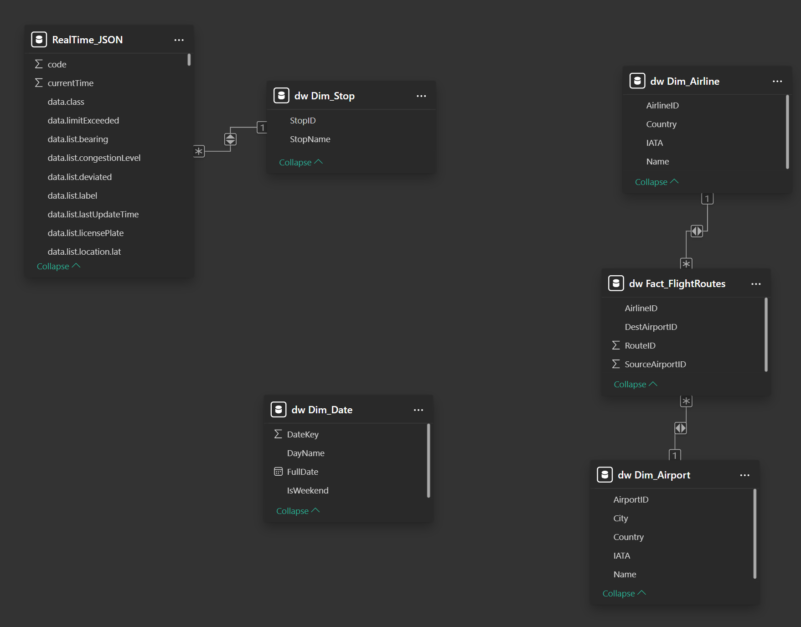
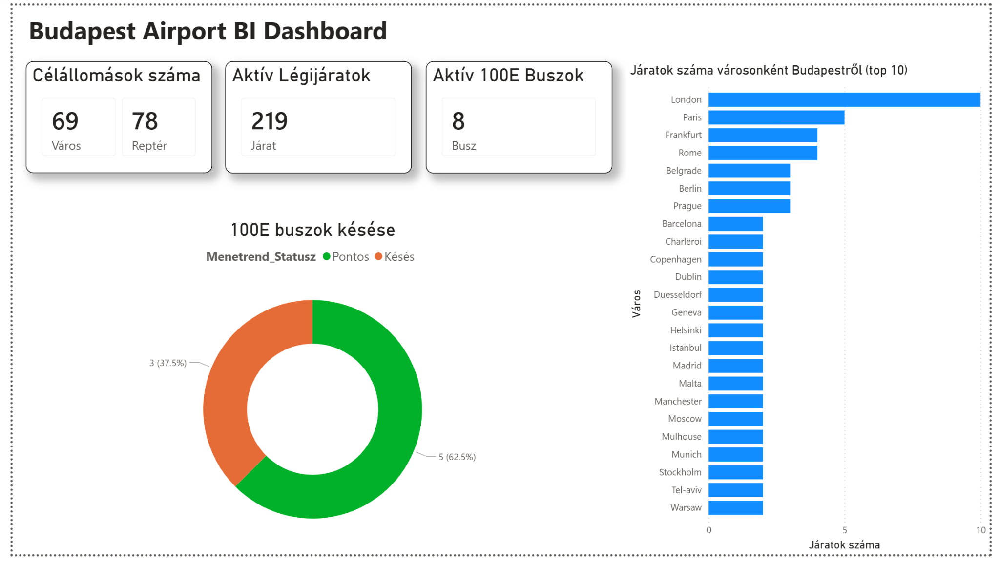
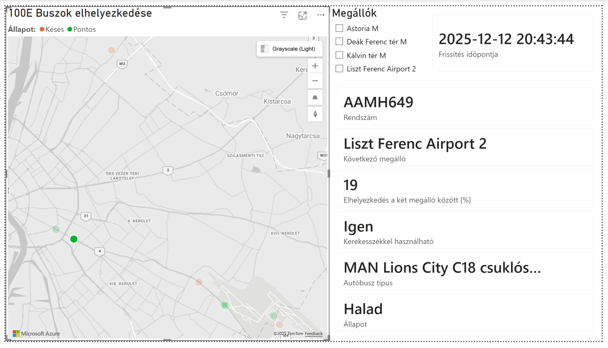

# BudAirport BI – Üzleti Intelligencia Rendszer Dokumentáció

**Készítette:** Sinkó Viktor Péter 
**Dátum:** 2025. december 12.  
**Téma:** Budapest-Liszt Ferenc Repülőtér elérhetőségének és légihálózatának elemzése

---

## 1. Vezetői Összefoglaló

A **BudAirport BI** projekt célja egy kisméretű, de teljes körű üzleti intelligencia rendszer megvalósítása, amely a budapesti repülőtér (BUD) forgalmi adatait és földi megközelíthetőségét vizsgálja. A rendszer heterogén adatforrásokat (statikus CSV állományok, GTFS menetrendi adatok és valós idejű API JSON folyamok) integrál egy központi adattárházba.

A megoldás lehetővé teszi a felhasználók számára:
* A repülőtér légihálózatának interaktív felfedezését (légitársaságok, országok, városok bontásban).
* A 100E repülőtéri buszjárat valós idejű nyomon követését és menetrendi pontosságának ellenőrzését.
* Kulcsfontosságú teljesítménymutatók (KPI-k) azonnali áttekintését.

---

## 2. Rendszerarchitektúra

A rendszer három fő rétegből épül fel, követve a modern BI megoldások sztenderdjeit:

1.  **Adatforrás Réteg (Data Layer):**
    * **OpenFlights:** Repülőterek, útvonalak és légitársaságok adatai (CSV).
    * **BKK GTFS:** Statikus menetrendi adatok és megállók (TXT).
    * **BKK FUTAR API:** Valós idejű járműpozíciók és státuszok (JSON).

2.  **Adatfeldolgozó Réteg (ETL & Storage):**
    * **Tárolás:** Microsoft SQL Server (LocalDB) – Relációs adatbázis.
    * **ETL (Extract-Transform-Load):** Python szkriptek végzik az adatok tisztítását, transzformációját és betöltését. A valós idejű adatokat egy külön Python "daemon" gyűjti.
    * **Adatmodell:** Csillagséma (Star Schema) a hatékony riportolás érdekében.

3.  **Megjelenítési Réteg (Presentation):**
    * **Power BI Desktop:** Interaktív dashboardok, térképes vizualizációk és Drill-down elemzések.

---

## 3. Adatmodell és Adattárház (Data Warehouse)

Az adatok tárolása egy **Csillagséma (Star Schema)** struktúrában valósult meg, amely biztosítja a gyors lekérdezéseket és az átlátható kapcsolatokat a Power BI számára.

**Sémák:**
* `stg` (Staging): Nyers adatok átmeneti tárolása.
* `dw` (Data Warehouse): A tisztított, végleges dimenzió- és ténytáblák.

### Az Adatmodell Diagramja
Az alábbi ábrán látható a megvalósított kapcsolatrendszer. Középen a `Fact_FlightRoutes` ténytábla helyezkedik el, amelyhez csatlakoznak a dimenziótáblák (`Dim_Airline`, `Dim_Airport`, `Dim_Date`). A valós idejű elemzéshez a `RealTime_JSON` tábla kapcsolódik a `Dim_Stop` táblához.

**Táblák definíciója:**
* **dw.Fact_FlightRoutes:** Ténytábla, amely tartalmazza az útvonalakat (Forrás, Cél, Légitársaság ID).
* **dw.Dim_Airline:** Légitársaságok törzsadatai (Név, IATA kód, Ország). *Kiemelt fejlesztés: Az eredeti kódok feloldása teljes nevekre.*
* **dw.Dim_Airport:** Repülőterek földrajzi adatai.
* **dw.Dim_Stop:** BKK megállók törzsadatai.

---

## 4. ETL Folyamatok és Python Implementáció

Az adatok betöltését két különálló Python modul végzi.

### 4.1. Statikus Adatbetöltés (`etl_static.py`)
Ez a szkript felelős az adatbázis inicializálásáért és a statikus állományok feldolgozásáért.

**Főbb funkciók:**
* **Adatbázis takarítás:** Minden futáskor biztosítja a konzisztenciát a régi adatok törlésével.
* **Névfeloldás (Lookup):** A `Fact_FlightRoutes` tábla töltésekor egy SQL `JOIN` művelettel párosítja a járatszámokat a légitársaságok teljes nevével, létrehozva a kapcsolatot a `Dim_Airline` táblával.
* **Dátum generálás:** Pythonban generálja le a naptári napokat 2024-2025 évre a `Dim_Date` tábla számára.

### 4.2. Valós Idejű Adatgyűjtés (`realtime_collector.py`)
A szkript folyamatosan fut a háttérben, és 30 másodpercenként lekérdezi a BKK publikus API-ját a **100E** jelzésű repülőtéri buszokra vonatkozóan.

* **Formátum:** JSON fájlokat ment időbélyeggel ellátva a `Data/RealTime_JSON` mappába.
* **Integráció:** A Power BI mappából (Folder connector) olvassa be ezeket a fájlokat, és csak a legfrissebbet jeleníti meg.

---

## 5. Vizualizáció és Riportok

A Power BI riport három fő oldalból áll, lefedve a specifikáció összes követelményét.

### 5.1. Vezérlőpult (Dashboard)
A nyitóoldal a menedzsment számára nyújt azonnali áttekintést.
* **KPI Kártyák:** Aktív célállomások, járatok száma és az éppen közlekedő buszok száma.
* **Top 10 Célállomás:** Sávdiagram a legnépszerűbb úti célokról (pl. London, Párizs).
* **Menetrendi Állapot:** Fánkdiagram, amely mutatja a pontos és késő járművek arányát.

### 5.2. Légihálózat Elemzése (Drill-down)
Ez az oldal a "Légihálózat" részletes vizsgálatát teszi lehetővé.
* **Decomposition Tree (Bontásfa):** Lehetővé teszi az interaktív lefúrást (Drill-down) a következő hierarchiában: *Légitársaság -> Ország -> Város*.
* **Légitársaság Szűrő:** Dinamikus szűrés, amely csak a Budapesten aktív légitársaságokat mutatja.
* **Térkép:** Vizuálisan ábrázolja a kiválasztott légitársaság hálózatát.

### 5.3. Reptér Elérhetősége (Real-Time Tracking)
A legösszetettebb technikai oldal, amely a BKK élő adatait vizualizálja.
* **GPS Térkép:** A buszok valós idejű pozíciója (zöld: halad, piros: áll/késik).
* **Intelligens Adatlap (Smart Card):** A térképen kiválasztott jármű részletes adatait mutatja (Rendszám, Következő megálló neve, Távolság %).
* **DAX Logika:** Egyedi DAX mérőszámok (Measures) biztosítják, hogy az adatlap csak kijelölés esetén jelenjen meg, és magyar nyelven írja ki a státuszokat ("Igen/Nem" a kerekesszékhez).

