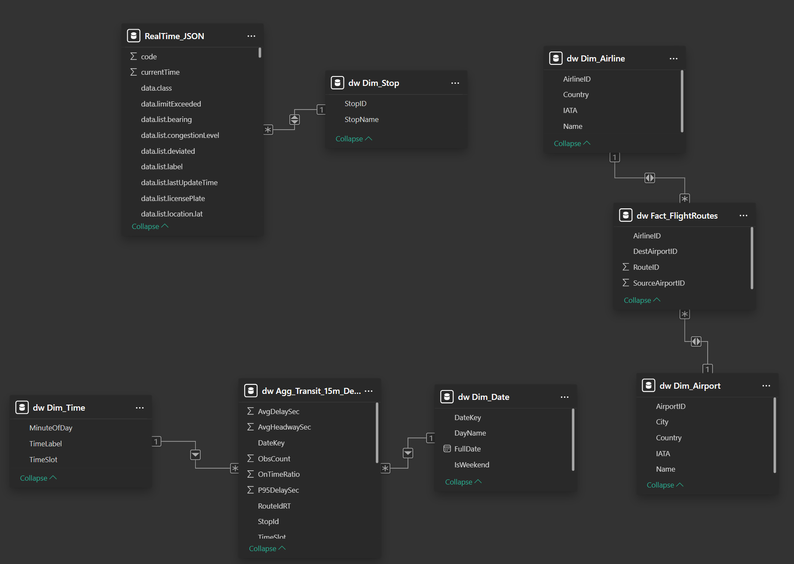
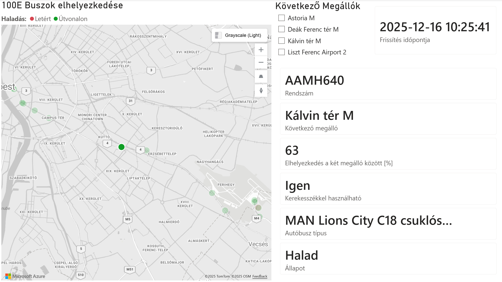
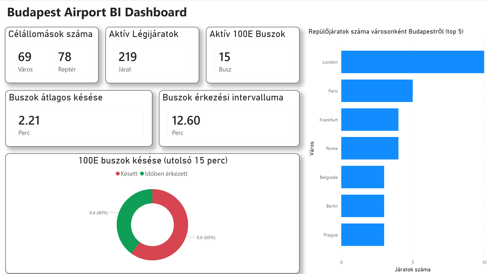
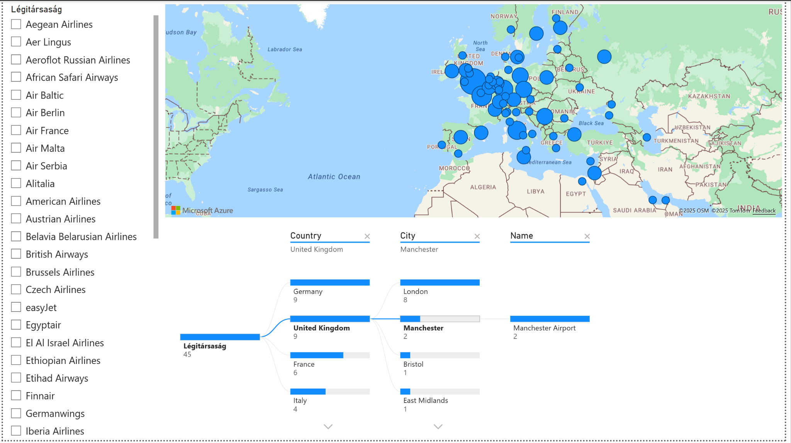
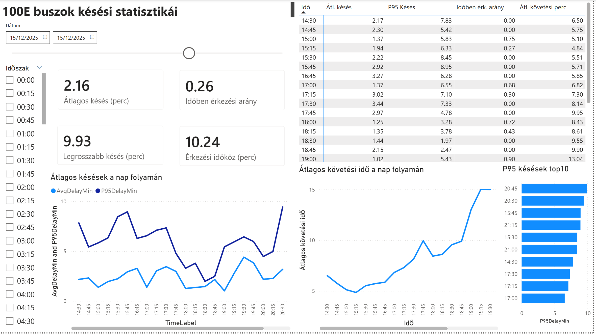

# BudAirport BI – Üzleti Intelligencia Rendszer Dokumentáció (végleges)

**Készítette:** Sinkó Viktor Péter  
**Dátum:** 2025-12-16  
**Projekt:** Budapest–Liszt Ferenc Repülőtér légihálózata + 100E repülőtéri busz (menetrend & real-time)

---

## Tartalomjegyzék

- [1. Vezetői összefoglaló](#1-vezetői-összefoglaló)  
- [2. Üzleti célok és kérdések](#2-üzleti-célok-és-kérdések)  
- [3. Adatforrások](#3-adatforrások)  
- [4. Architektúra és csillagséma](#4-architektúra-és-csillagséma)  
- [5. ETL folyamat – statikus adatok](#5-etl-folyamat--statikus-adatok)  
- [6. Real-time folyamat – 100E busz](#6-real-time-folyamat--100e-busz)  
- [7. 15 perces aggregálás és metrikák](#7-15-perces-aggregálás-és-metrikák)  
- [8. Power BI riport – oldalak és vizuálok](#8-power-bi-riport--oldalak-és-vizuálok)  
- [9. Demo késések (miért és hogyan)](#9-demo-késések-miert-és-hogyan)  
- [10. Reprodukálhatóság – futtatási lépések](#10-reprodukálhatóság--futtatási-lépések)  
- [11. Korlátok és továbbfejlesztési ötletek](#11-korlátok-és-továbbfejlesztési-ötletek)  

---

## 1. Vezetői összefoglaló

A **BudAirport BI** projekt egy komplett, “mini end-to-end” BI rendszer: több forrásból (statikus fájlok + GTFS menetrend + real-time API) adatokat gyűjt, tisztít, betölt egy SQL Server adattárházba, majd Power BI-ban vizualizálja.

A megoldás két témát kapcsol össze:

- **Légihálózat elemzés:** Budapestről (BUD) induló járatok célállomásai, légitársaságok, országok és városok feltérképezése.  
- **Reptéri megközelíthetőség (100E):** a 100E busz **valós idejű** mozgása és **menetrendi teljesítménye** (késés, pontosság, követési idő).

A BI rendszer így egyszerre támogat **múltbeli elemzést** (OpenFlights + GTFS) és **monitoring jellegű** nézetet (FUTAR real-time).

---

## 2. Üzleti célok és kérdések

A projekt célja, hogy bemutatható és értelmezhető KPI-ket adjon a következő kérdésekre:

### 2.1. Légiközlekedés (BUD)
- Mely városokba repül a legtöbb járat Budapestről? (Top célállomások)
- Mely légitársaságok a legaktívabbak?
- Mely országok / régiók dominálnak a hálózatban?
- Drill-down: légitársaság → ország → város → repülőtér

### 2.2. 100E busz (reptéri kapcsolat)
- Hány busz aktív egy adott időpillanatban?
- Mekkora az **átlagos késés** és mik a **szélsőértékek** egy napon belül?
- Mekkora az **időben érkezések aránya**?
- Mekkora az átlagos **követési idő** (headway) – mennyire “sűrűn” jön a busz?
- Hol vannak a buszok a városban (térkép), és milyen a státuszuk (halad/áll/útvonalon kívül, stb.)?

---

## 3. Adatforrások

A rendszer 3 fő adatforrást integrál:

1. **OpenFlights** (CSV / .dat):  
   - repülőterek, légitársaságok, útvonalak (forrás–cél párok)  
   - cél: BUD hálózat elemzése, földrajzi vizualizáció

2. **BKK GTFS** (TXT):  
   - megállók, járatok, menetrendi naptár (calendar_dates), menetek (trips), és a 100E-hez a stop_times  
   - cél: dimenziók (megálló/járat) és a menetrendi referencia biztosítása

3. **BKK FUTAR API** (JSON):  
   - **jármű pozíció**: “vehicles” jellegű lekérdezés (térképes oldalhoz)  
   - **arrivals**: “arrivals-and-departures-for-stop” lekérdezés (késés, pontosság, headway számításhoz)

> Megjegyzés: a FUTAR egyes végpontjai nem minden esetben adnak “késést” explicit módon. Emiatt a projektben a bemutatóhoz **demo késéseket** alkalmaztam (lásd [9. fejezet](#9-demo-késések-miert-és-hogyan)).

---

## 4. Architektúra és csillagséma

A megoldás rétegezett felépítésű:

**Forrás fájlok / API → STAGING (stg) → Data Warehouse (dw) → Power BI riport**

### 4.1. Mi az a `stg` és `dw`?
- **`stg` (staging):** “lerakó” a nyers adatoknak. Itt még lehetnek duplikációk, hiányzó mezők, forrás-specifikus oszlopnevek.  
- **`dw` (data warehouse):** tisztított, elemzésre optimalizált struktúra. Itt vannak a **dimenziók** és **ténytáblák**.

### 4.2. Csillagséma (Star Schema) – miért jó?
A Power BI gyors és logikus működéséhez az a jó, ha:
- a **ténytáblákban** vannak a mérések (pl. járatszám, késés, darabszám),
- a **dimenziók** adják a szűrési tengelyeket (dátum, idő, megálló, légitársaság, repülőtér…).

**A projektben két fő “ténytábla jellegű” dolog van:**
- `dw.Fact_FlightRoutes` – repülős útvonalak (BUD → cél)  
- `dw.Agg_Transit_15m_Demo` – 100E 15 perces aggregált mutatók (késés, pontosság, headway)

### 4.3. Power BI modell (kapcsolatok)

**Magyarázat a képről:**
- A repülős oldal csillagsémája a `dw.Fact_FlightRoutes` köré épül (`dw.Dim_Airline`, `dw.Dim_Airport`).
- A busz-statisztika oldal csillagsémája a `dw.Agg_Transit_15m_Demo` köré épül (`dw.Dim_Date`, `dw.Dim_Time`, opcionálisan `dw.Dim_Stop`).
- A “térképes real-time” oldal külön irány: ott a Power BI a mentett JSON-ból (`RealTime_JSON`) rajzol, és ezt kapcsolja a `dw.Dim_Stop` táblához megálló név feloldás miatt.

---

## 5. ETL folyamat – statikus adatok

A statikus ETL célja: OpenFlights + GTFS adatok betöltése, majd dimenziók és ténytáblák előállítása.

**Fő komponensek:**
- `Create_schema.sql` – adatbázis, sémák (`stg`, `dw`), táblák létrehozása
- `etl_static.py` – betöltés és transzformáció (fájl → stg → dw)

### 5.1. Betöltött statikus táblák
**Staging (`stg`) példák:**
- `stg.OpenFlights_Airports`, `stg.OpenFlights_Routes`, `stg.OpenFlights_Airlines`
- `stg.GTFS_Stops`, `stg.GTFS_Routes`, `stg.GTFS_Trips`, `stg.GTFS_CalendarDates`
- `stg.GTFS_StopTimes` (csak 100E-re szűkítve, hogy ne legyen óriási)

**DW (`dw`) példák:**
- `dw.Dim_Airport`, `dw.Dim_Airline`, `dw.Dim_Stop`, `dw.Dim_Date`
- `dw.Fact_FlightRoutes`
- a GTFS-ből további táblák: `dw.Dim_RouteLine`, `dw.Fact_ScheduledSegments`, `dw.Bridge_ServiceDate`

### 5.2. Miért “csak 100E stop_times”?
A GTFS `stop_times.txt` tipikusan a legnagyobb fájl. A projekt fókusza a **100E**, ezért az ETL csak a 100E-hez tartozó `trip_id`-k stop_times sorait tölti be.  
Ezzel a rendszer:
- gyorsabban fut,
- kisebb adatbázist hoz létre,
- mégis teljesíti a specifikációt (reptéri busz menetrendi vizsgálata).

---

## 6. Real-time folyamat – 100E busz

A real-time cél kettős:

1. **Térképes monitoring:** épp hol vannak a buszok (GPS), milyen a státuszuk.  
2. **Késés és headway statisztika:** érkezések alapján “menetrend-teljesítmény” KPI-k előállítása.

### 6.1. Járműpozíciók (térképes oldal)
A `realtime_collector.py` 30 másodpercenként lekérdezi a FUTAR API-t (100E), és JSON fájlokat ment. A Power BI “Folder” csatlakozóval beolvassa, és **a legfrissebb fájlt** vizualizálja.

**Mit látunk ezen az oldalon?**
- **Térkép:** járművek aktuális helye.  
- **Smart kártyák (jobb oldal):** kiválasztott busz részletei (rendszám, következő megálló, akadálymentesség, jármű típus, állapot).  
- **Slicer “Következő megállók”:** gyors szűrés tipikus megállókra (Astoria, Deák, Kálvin, Reptér…).

### 6.2. Arrivals (érkezések) – késés és követési idő
A `realtime_ingest_100e.py` a FUTAR “arrivals-and-departures-for-stop” végpontját hívja egy kiválasztott megállóra, és a kapott érkezéseket SQL-be tölti.

Az érkezési adatokból 2 fontos dolog számítható:
- **Késés (DelaySec):** PredictedArrival − ScheduledArrival (másodpercben)  
- **Headway:** két egymást követő busz érkezésének időköze ugyanarra a megállóra (pl. 12 perc)

---

## 7. 15 perces aggregálás és metrikák

A Power BI-ban kétféleképpen lehet dolgozni:
- vagy a nyers érkezéseket vizualizálom (sok sor, lassabb),
- vagy **előre aggregálok** (15 perces slotok), és a BI már kész KPI-ket kap (gyors, stabil).

A projektben a busz késés statisztikákhoz **15 perces aggregált tábla** készül:

- `dw.Agg_Transit_15m_Demo`

### 7.1. Mit tartalmaz az `Agg_Transit_15m_Demo`?
Minden sor egy “időszeletet” jelent:

- **DateKey**: pl. 20251215  
- **TimeSlot**: 15 perces sorszám a napon belül (0–95)  
- **StopId**: megálló azonosító (pl. `BKK_F00950`)  
- **RouteIdRT**: real-time route azonosító (100E / `BKK_1005`)  
- **AvgDelaySec**: átlagos késés (másodperc)  
- **P95DelaySec**: “rossz eset” késés (95%-os percentilis)  
- **OnTimeRatio**: időben érkezések aránya (0–1)  
- **ObsCount**: hány megfigyelés / érkezés volt a slotban  
- **AvgHeadwaySec**: átlagos követési idő (másodperc)

### 7.2. Headway (követési idő) – mit jelent?
A **headway** azt jelenti, mennyi idő telik el két egymás utáni busz érkezése között.

Példa:
- 14:00-kor jön egy busz, 14:12-kor jön a következő → headway = 12 perc.  
Ha a headway nő, az általában ritkább járatot / “lyukakat” jelez.

### 7.3. P95Delay (95. percentilis) – “mi ez?”
A **P95** egy robusztus “rossz eset” mutató:  
úgy lehet elképzelni, hogy **az esetek 95%-ában a késés ennél kisebb**, és csak a legrosszabb 5% rosszabb ennél.

Miért jó?
- Az átlagot könnyen torzítja 1-2 nagyon nagy késés.
- A P95 jobban mutatja, mennyire “kockázatos” egy adott időszak.

---

## 8. Power BI riport – oldalak és vizuálok

A riport 4 fő, egymást kiegészítő oldalból áll.

### 8.1. Fő dashboard (menedzsment nézet)

**Tartalom:**
- **KPI kártyák:** célállomások / repterek száma, aktív légijáratok száma, aktív 100E buszok száma.  
- **Top célvárosok sávdiagram:** gyors “hova repülünk a legtöbbet?” áttekintés.  
- **100E késés donut:** *késve vs időben* arány (bemutatóra jól kommunikálható).  
- **Plusz kártyák:** átlagos késés (perc) és átlagos headway (perc).

**Narratíva (bemutatón):**
> “A felső KPI sor egy 10 másodperces helyzetkép, a donut megmutatja a 100E pontosságát, a jobb oldali top lista pedig a BUD légihálózat fókuszát.”

### 8.2. Légihálózat: térkép + drill-down (decomposition tree)

**Mit tud ez az oldal?**
- **Térkép:** célrepterek megjelenítése (buborék méret = járatok száma).  
- **Slicerek:** légitársaság kiválasztás / szűrés.  
- **Decomposition tree:** interaktív lefúrás: légitársaság → ország → város → repülőtér.  
  Ez a “miért ez a top város?” kérdésre is választ ad.

### 8.3. 100E buszok késési statisztikái (idősoros elemzés)

**Mi a lényege?**
- **Dátum és idősáv szűrés** (napon belüli 15 perces bontás).  
- **KPI-k:** átlagos késés, időben érkezési arány, P95 késés, headway.  
- **Táblázat:** időslotonként részletes értékek (jó kontroll / validáció).  
- **Grafikonok:** trendek a nap folyamán (hol “romlik el” a menetrend? hol nő a követési idő?).  
- **Top10 P95:** bemutatóra jó “legrosszabb időszakok” lista.

### 8.4. 100E buszok elhelyezkedése (real-time monitoring)

**Bemutató szöveg:**
> “Ez a lap nem csak statisztika: élőben látom a buszokat, kiválasztok egyet, és azonnal kapok jármű infókat és következő megállót.”

---

## 9. Demo késések (miért és hogyan)

### 9.1. Miért volt szükség demo késésre?
A FUTAR “arrivals” végpontja a gyűjtött időszakban sokszor úgy jött vissza, hogy:
- a tervezett és a prediktált érkezési idő megegyezett, vagy
- a késés mező nem volt kitöltve.

Ezért a “valós késés arány” a riportban sokszor 0-hoz közeli lett, ami demó szempontból **nem látványos**.

### 9.2. Mit csinál a demo logika?
A demo nézet lényege: **a valós érkezési események megmaradnak**, csak a késés érték kap egy *determinista* (ismételhető) módosítást néhány esetben, hogy legyen szórás és legyen mit ábrázolni.

- A `demo_view_with_delays.sql` egy olyan view-t készít, ami a nyers érkezési táblából “előállít” demo DelaySec értéket.
- Az aggregáló stored procedure innen építi fel az `Agg_Transit_15m_Demo` táblát.

> Fontos: ettől a rendszer továbbra is “real-time jellegű”, mert a sorok időbélyege és az érkezési események a valós gyűjtésből jönnek – csak a késés érték kap demó-tuningot.

---

## 10. Reprodukálhatóság – futtatási lépések

### 10.1. Egyszeri inicializálás
1. SQL Serverben futtasd: `Create_schema.sql`  
2. Ellenőrzés: létrejöttek `stg` és `dw` sémák, táblák.

### 10.2. Statikus ETL (OpenFlights + GTFS)
1. Futtasd: `etl_static.py`  
2. Ellenőrzés (példák):
   - `dw.Dim_Airport` sorok száma
   - `dw.Fact_FlightRoutes` sorok száma
   - `dw.Dim_Date` (2024–2026 napok)

### 10.3. Real-time gyűjtés (JSON mentés)
1. Futtasd: `realtime_collector.py` (térképes oldalhoz)  
2. Fut közben: `Data/RealTime_JSON/` mappába folyamatosan ír fájlokat.

### 10.4. Arrivals ingest (SQL-be töltés)
1. Futtasd: `realtime_ingest_100e.py`  
2. Ellenőrzés:
   - `stg.RealTime_StopArrivals` nő
   - van friss `SnapshotDT`

### 10.5. Aggregálás (15 perces demo tábla)
1. Futtasd SQL-ben: `run_agg.sql` (vagy az adott `EXEC ...` hívást)  
2. Ellenőrzés:
   - `SELECT TOP 50 * FROM dw.Agg_Transit_15m_Demo ORDER BY DateKey DESC, TimeSlot DESC;`

### 10.6. Power BI frissítés
- Power BI Desktop → **Refresh**  
- Ellenőrizd a fő oldalon a KPI-ket és a donut arányt.

---

## 11. Korlátok és továbbfejlesztési ötletek

**Korlátok:**
- Power BI Desktop nem “push” real-time: frissítés tipikusan manuális (vagy Service + gateway + schedule).  
- A FUTAR egyes lekérdezésekben a késés mező nem mindig megbízható / nem mindig elérhető. Emiatt demó késés kellett.

**Továbbfejlesztés:**
- Power BI Service + On-premises data gateway + ütemezett frissítés (pl. 15 perc).  
- Inkrementális frissítés (csak új napok / új slotok).  
- Több megálló / irány bevonása (nem csak 1 stop arrivals).  
- Valódi “delay” számítás GTFS menetrendi stop_times + real-time trip mapping alapján (komplexebb, de “tiszta”).
